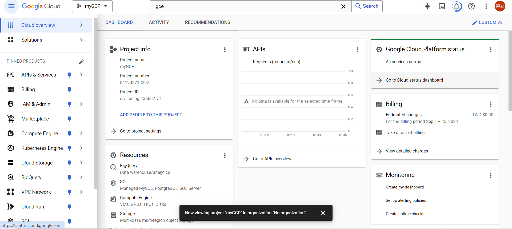
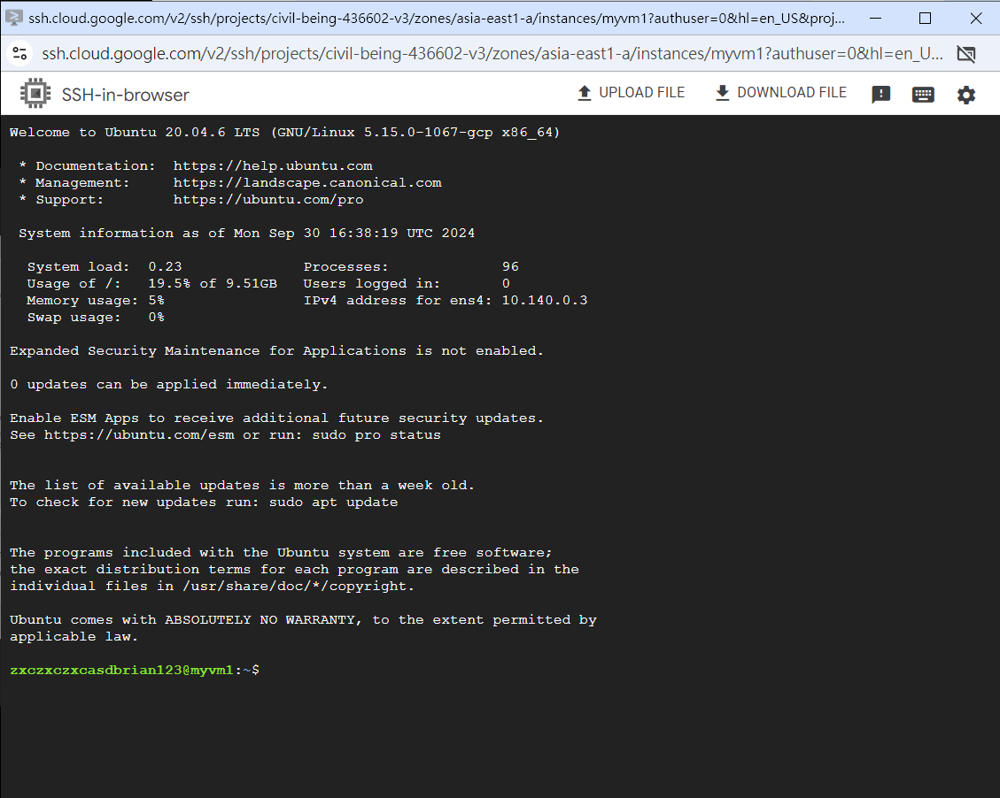
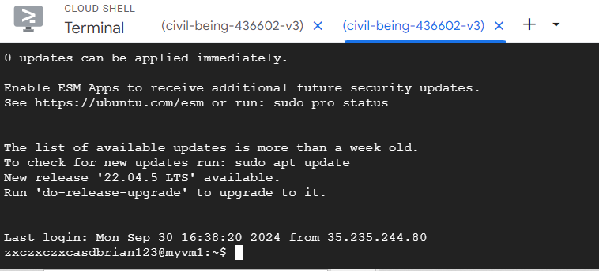

# 第三周
# 使用雲端的好處
* 用多少收多少錢
* 增加可靠度
* 降低延遲性
* 有些國家要求資料不能放置在其他國家，如果要在該國提供服務，只能把雲端建置在當地
# GCE(Google Compute Engine)
* 從頭打造一台客製化機器，所有維護、操作全部用最高權限管理
* 可使用python、java等寫出功能
* 負載過重時會自動降低
# 增加PROJECT
點進NEW Project  ↓ 
Project name :取名  ↓ 
Location:No organization ↓ 
CREATE  ↓ 
點進創建的Project

# 雲端提供的服務
* 運算
* 儲存
* 網路
# 建立虛擬機
進入Compute Engine  ↓ 
VM instances ↓ 
點擊Create Instance ↓ 
Name:myvm1 ↓ 
Region:asia-east1(Taiwan) ↓ 
Zone:asia-east1-a ↓ 
Avaliability policies:Standard ↓ 
Machine configuuration:選擇N1 ↓ 
Machine type:選擇n1-standard(1 vCPU,3.75GB memory) ↓ 
Operating system and storage:點擊Change ↓ 
Operating system:選擇Ubuntu ↓ 
Version:Ubuntu 20.04LTS ↓ 
Boot disk type:Standard persistent disk ↓ 
Size(GB):10 ↓ 
SELECT ↓ 
Firewall:Allow HTTP traffic ↓ 
CREATE
# 連接進入虛擬機
* 直接連接 
  直接點擊右邊的"SSH"即可連接
  
* 點擊網頁上方的正方形圖標(Activate Cloud Shell) 
輸入gcloud compute ssh myvm1 --project=civil-being-436602-v3 --zone=asia-east1-a 
(記得更改myvm1為當下虛擬機名字，civil-being-436602-v3當下Project ID，asia-east1-a地區) ↓ 
完成連接

