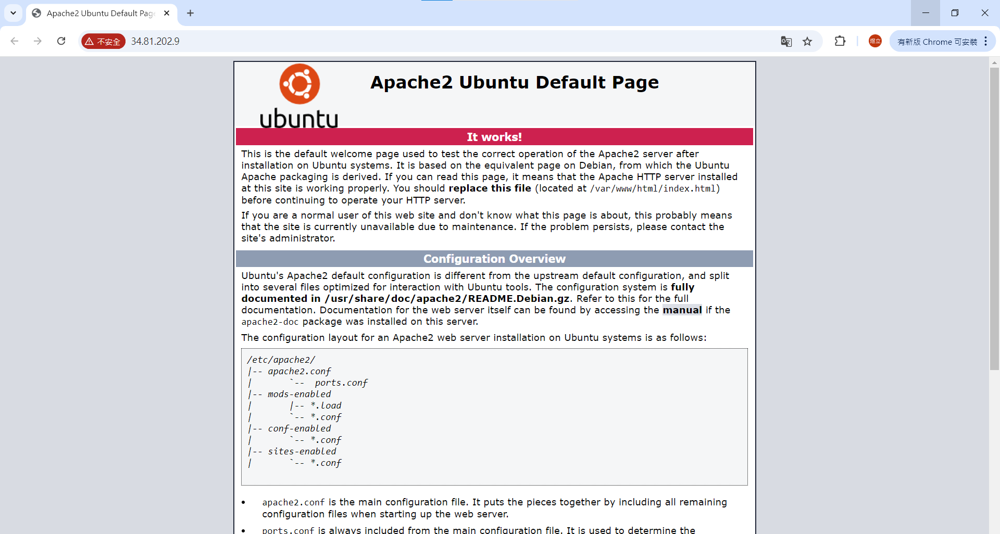
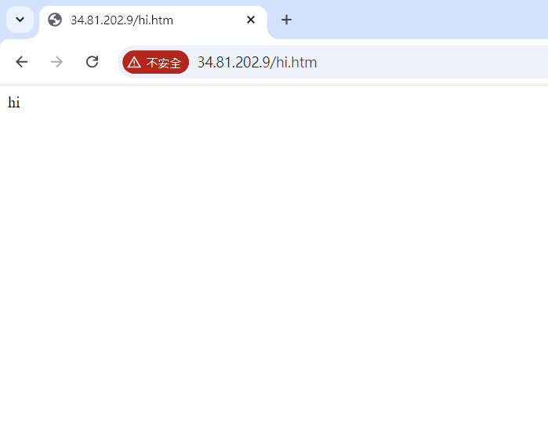
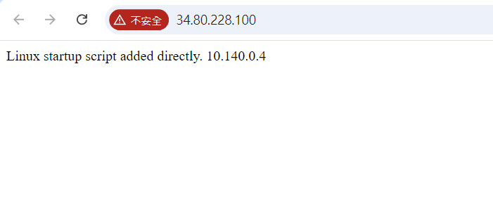
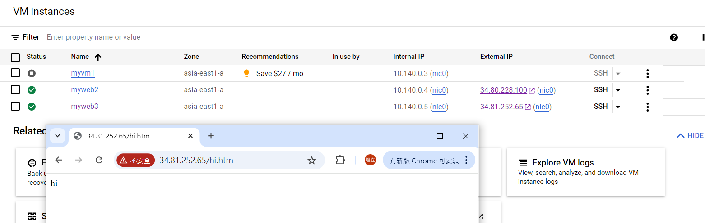

# 第四周
## Google App Engine
* PAAS solution
* Fully managed service
* Deploy web at high scale
*  Standard & Flexible Environment
*  Flexible Environment use Docker
## Google Cloud Run
* PAAS solution
* Containerized applications
* Best of(GAE + Container)
## Google Cloud Functions
* Server less
* Fully managed
* Build small micro service
* Event based trigger
  * Http
  * File upload etc.
## Cloud Storage Location
* Region
  * Lowest latency within a single region
  * Replicated data across multiple aone in single region
* Dual-region
  * High availability and low latency across 2 regions(Paired region)
* Multi-region
  * Highest availability across continent area
## Cloud storage classes
* Standard: 想存取即可得到，比較貴
* Nearline: 30天做一次存取
* Coldine: 90天做一次存取
* Archive: 一年做一次存取，價格低
## 製作網頁
創建一台虛擬機後，點擊右側SSH<br>↓<br>
sudo apt update <br>↓<br>
sudo apt install apache2<br>↓<br>
sudo systemctl status apache2(檢查狀態是否啟動)<br>↓<br>
sudo apt install net-tools<br>↓<br>
sudo netstat -tunlp | grep 80<br>↓<br>
點擊External IP，出現伺服器

cd /var/www/html(網頁的目錄)<br>↓<br>
sudo bash -c 'echo "hi" > hi.htm'<br>↓<br>
ls<br>↓<br>
cat hi.htm<br>↓<br>
在剛剛打開的網址後面加上/hi.htm<br>↓<br>

sudo bash -c 'echo "$(hostname -I)" > test.htm'<br>↓<br>
cat test.htm<br>↓<br>
在剛剛打開的網址後面加上/test.htm即可看到IP
## 開機時自動把網頁做好
創建一台虛擬機Craete Instance<br>↓<br>
Name:myweb2<br>↓<br>
Region:asia-east1(Taiwam)<br>↓<br>
Zone:any<br>↓<br>
Machine Configuration:N1<br>↓<br>
Boot disk:選擇Ubuntu<br>↓<br>
SELECT<br>↓<br>
Firewall:勾選Allow HTTP traffic<br>↓<br>
Advanced<br>↓<br>
Automation: <br>
````
    #! /bin/bash
    apt update
    apt -y install apache2
    cat <<EOF > /var/www/html/index.html
    <html><body><p>Linux startup script added directly. $(hostname -I) </p></body></html>
````
<br>↓<br>
CREATE<br>
等待一分鐘，點擊External IP

## 創建鏡像虛擬機
點擊想要鏡像的虛擬機旁邊三個黑點，選擇Stop<br>↓<br>
點擊左側Compute Engine下面的images<br>↓<br>
CREATE IMAGE<br>↓<br>
Name:myweb1-image<br>↓<br>
Source:Disk<br>↓<br>
Source disk:選擇要鏡像的虛擬機<br>↓<br>
Location選擇Regional<br>↓<br>
Create<br>↓<br>
點擊剛創建的鏡像Actions下的3個黑點<br>↓<br>
Create instance<br>↓<br>
Name:myweb3
Region:asia-east1(Taiwam)<br>↓<br>
Firewalls:Allow HTTP traffic<br>↓<br>
Create<br>↓<br>
點擊External IP<br>↓<br>
在IP後面輸入hi.htm

## 使IP固定不變
Stop myweb3虛擬機<br>↓<br>
點進myweb3， Edit<br>↓<br>
找到Network interfaces，展開default<br>↓<br>
External IPv4 address:點擊Reserve Static External IP Address<br>↓<br>
Name:mystaticip1<br>↓<br>
Reserve<br>↓<br>
Save<br>↓<br>
啟動myweb3
## 
