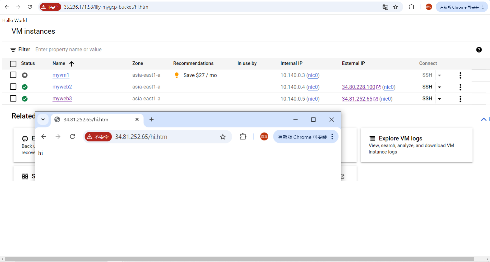

# 第五周
## 把網頁上傳雲端
* 創建bucket<br>
到google cloud 找到cloud storge<br>↓<br>
Create<br>↓<br>
name:lily-mygcp-bucket<br>↓<br>
continue<br>↓<br>
Location type選擇region<br>↓<br>
選擇asia-east1 (Taiwan)<br>↓<br>
continue<br>↓<br>
Choose a storage class for your data選擇Standard<br>↓<br>
continue<br>↓<br>
Access control選擇Uniform<br>↓<br>
continue<br>↓<br>
continue<br>↓<br>
Create
* 上傳網頁
在本地端創建一個網頁<br>↓<br>
點進剛創建的bucket<br>↓<br>
upload<br>↓<br>
上傳剛剛創建的網頁<br>↓<br>

## 第二種上傳網頁的方法
創建另一個bucket<br>↓<br>
創建另一個網頁<br>↓<br>
點擊google cloud上方的cloud shell<br>↓<br>
點擊cloud shell介面的三個點More<br>↓<br>
點擊uploud上傳網頁及其資料夾<br>↓<br>

## gsutil指令
輸入gsutill ls gs://查看bucket列表<br>↓<br>
gsutil cp TEST123.htm gs://lily-mygcp-bucket2/拷貝網頁至bucket<br>↓<br>
gsutil cp -r TEST123.files gs://lily-mygcp-bucket2/<br>↓<br>

## 產生網頁
到Compute Engine頁面<br>↓<br>
Create Instance新增虛擬機<br>↓<br>
點擊ssh連線虛擬機<br>↓<br>

````
gsutil ls gs://
cd lily-mygcp-bucket/
ls
sudo apt update
sudo apt install apache2 -y
cd ..
sudo cp -r lily-mygcp-bucket/ /var/www/html
````
點擊虛擬機網址，後面加上/lily-mygcp-bucket/hi.htm

## 從雲端下載檔案
進入ssh連線<br>↓<br>
ls<br>↓<br>
echo "test" > test.txt<br>↓<br>
ls<br>↓<br>
pwd<br>↓<br>
點擊上方Download file<br>↓<br>
path:/home/zxczxczxcasdbrian123/test.txt<br>↓<br>
Download<br>↓<br>

## 解決權限不夠問題
* 設定Role<br>
在google cloud搜尋IAM<br>↓<br>
到Service accounts頁面<br>↓<br>
Create Service Account<br>↓<br>
Service annount name:mysa-gs<br>↓<br>
Service account description:service account to write the files into GS<br>↓<br>
Create and continue<br>↓<br>
Select a role 選擇Sroage Admin<br>↓<br>
Continue<br>↓<br>
Done<br>
*
回到Compute Engine<br>↓<br>
Stop目前虛擬機<br>↓<br>
點進虛擬機Edit<br>↓<br>
找到Identity and API access<br>↓<br>
Service accounts選擇剛剛創建的mysa-gs<br>↓<br>
save<br>↓<br>
啟動虛擬機<br>↓<br>
