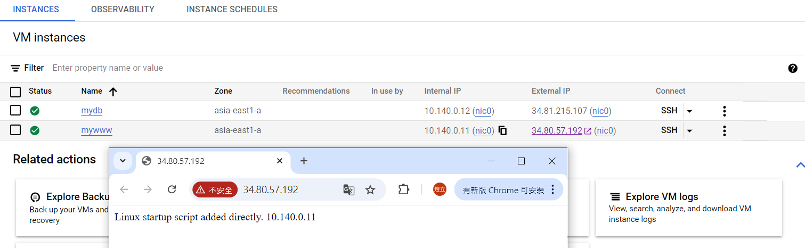

# 第六周
## 製作Database
創建一台www虛擬機，在Automation貼上

````
#! /bin/bash
 apt update
 apt -y install apache2
 cat <<EOF > /var/www/html/index.html
 <html><body><p>Linux startup script added directly. $(hostname -I) </p></body></html>
````

創建一台Database虛擬機，Ubuntu版本選擇22.04LTS(2024-099-27)，不需要勾選Firewall的Allow HTTP traffic<br>↓<br>
在DB虛擬機裡按照網頁教學進行安裝MariaDB<br>
https://blog.tarswork.com/post/mariadb-install-record
