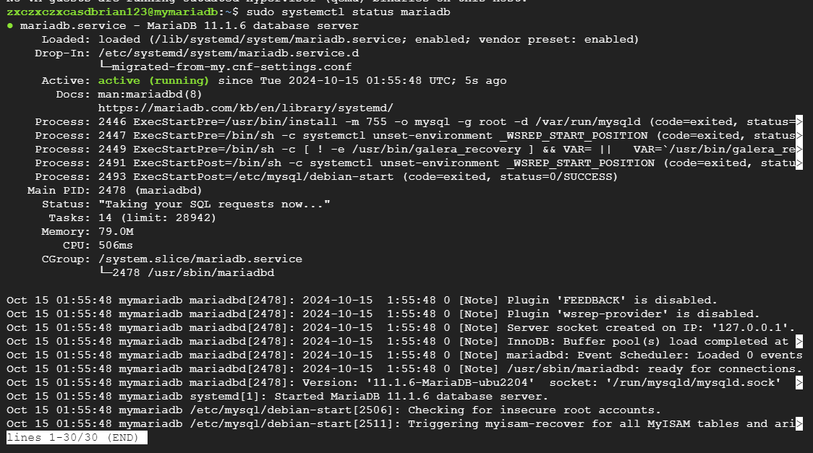
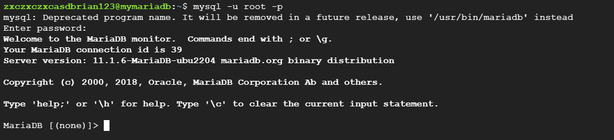
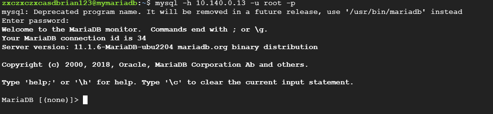
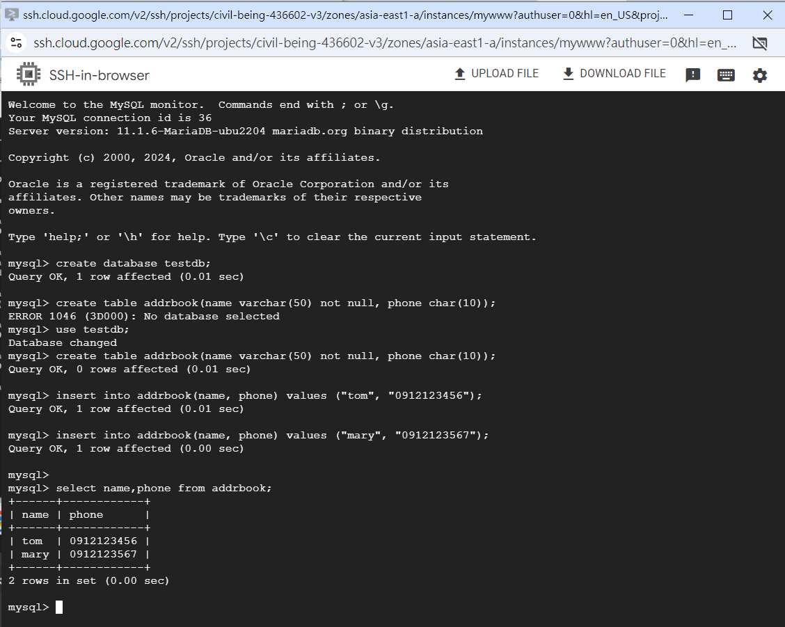

# 第六周
## 製作Database
創建一台www虛擬機，在Automation貼上

````
#! /bin/bash
 apt update
 apt -y install apache2
 cat <<EOF > /var/www/html/index.html
 <html><body><p>Linux startup script added directly. $(hostname -I) </p></body></html>
````

創建一台Database虛擬機，Ubuntu版本選擇22.04LTS(2024-099-27)，不需要勾選Firewall的Allow HTTP traffic<br>↓<br>
在DB虛擬機裡按照網頁教學進行安裝MariaDB<br>
https://blog.tarswork.com/post/mariadb-install-record<br>
sudo systemctll status mariadb查看是否成功安裝

mysql -u root -p輸入密碼登入資料庫

sudo apt install net-tools<br>
sudo netstat -tunlp | grep 3306查看<br>

## 允許外部連線
sudo vim /etc/mysql/mariadb.conf.d/50-server.cnf<br>↓<br>
把bind-address = 127.0.0.1改成bind-address = 0.0.0.0<br>↓<br>
:wq保存<br>↓<br>
sudo systemctl restart mariadb.service<br>↓<br>
ip addr show查看ip<br>↓<br>
mysql -h 127.0.0.1 -u root -p登入DB<br>↓<br>
GRANT ALL PRIVILEGES ON *.* TO 'root'@'%' IDENTIFIED BY '123456' WITH GRANT OPTION;<br>↓<br>
FLUSH PRIVILEGES;<br>↓<br>
mysql -h 10.140.0.13(ip) -u root -p<br>↓<br>

## 從WWW虛擬機登入DB
開啟WWW虛擬機<br>↓<br>
sudo apt install mysql-client<br>↓<br>
mysql -h 10.140.0.13 -u root -p
## 防火牆
若www虛擬機登入不了則需要新增防火牆規則<br>
搜尋VPC network，左側找到Firewall policies<br>↓<br>
Create Firewall Rule<br>↓<br>
Name:allow-3306<br>↓<br>
Description: allow traffic to connect to port 3306<br>↓<br>
Network:選擇default<br>↓<br>
Direction of traffic:Ingress<br>↓<br>
Action on match:allow<br>↓<br>
Target tags:allow-3306<br>↓<br>
Source IPv4 ranges:10.149.9.9/16(視ip而定)<br>↓<br>
Protocols and ports:勾選TCP，Ports:3306<br>↓<br>
Create<br>↓<br>
回到Compute Engine<br>↓<br>
Stop DB虛擬機，點進去修改規則<br>↓<br>
Network tags:allow-3306<br>↓<br>
Save，啟動DB虛擬機<br>↓<br>
## 新增資料庫資料
打開DB虛擬機<br>↓<br>
mysql -u root -p<br>
https://github.com/stereomp3/note/blob/main/linux/111semester01/13-.md<br>
````
create database testdb;  
use testdb; 
create table addrbook(name varchar(50) not null, phone char(10));
insert into addrbook(name, phone) values ("tom", "0912123456");
insert into addrbook(name, phone) values ("mary", "0912123567");
select name,phone from addrbook;
````


## PHP
https://docs.ossii.com.tw/books/ubuntu-server-2004-apache-mariadb-php/page/php-81<br>
開啟www虛擬機
sudo dpkg -l | grep apache2
````
sudo apt install apache2-utils -y
sudo apt install software-properties-common
sudo add-apt-repository ppa:ondrej/php
sudo apt update
sudo apt install php8.1 libapache2-mod-php8.1 php8.1-gd php8.1-mysql php8.1-curl php8.1-mbstring php8.1-intl -y
sudo apt install php8.1-gmp php8.1-bcmath php8.1-imagick php8.1-xml php8.1-zip -y
sudo a2enmod php8.1
sudo systemctl restart apache2
sudo vim info.php
sudo cp info.php /var/www/html/
````

