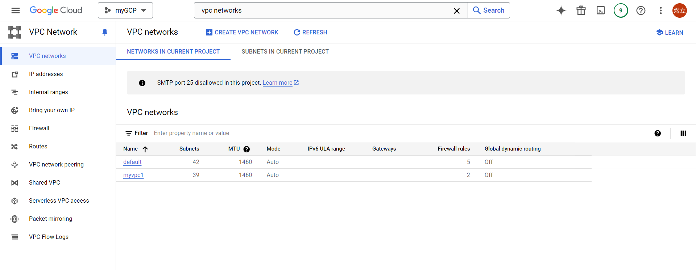
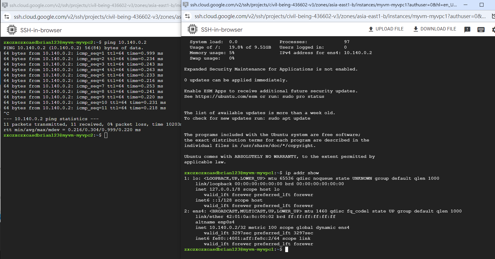
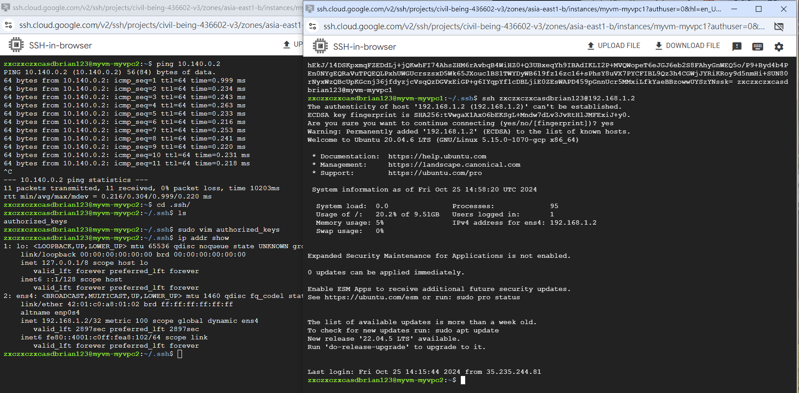

# 第七周
## 重啟300美金
https://www.shanyemangfu.com/gcp-300-old-account.html
## 設置VPC network
* Automatic
````
搜尋vpc network
Create a VPC network
name:myvpc1
Subnet creation mode選擇Automatic
Firewall rules選擇myvpc1-allow-icmp與myvpc1-allow-ssh
CREATE
````


* Custom
````
Create a VPC network
name:myvpc2
Subnet creation mode選擇Custom
New subnet
name:asia-east1
Description:for tw subnet
Region:asia-east1
IPv4 range:192.168.1.0/24
CREATE
````
## Firewall 設置
````
到Firewall頁面
Create a firewall rule
name:myvpc2-allow-ssh
Network選擇myvpc2
Targets選擇All instances in the network
Source IPv4 ranges:0.0.0.0/0
勾選TCP，Ports:22
勾選Other，Protocols:icmp
Create
````


## 創建虛擬機
````
name:myvm-myvpc1
Region:asia-east1 (Taiwan)
Machine configuration:選擇N1
Operating system and storage選擇Ubuntu
Edit network interfaces
Network選擇myvpc1
Create
````
````
name:myvm-myvpc2
Region:asia-east1 (Taiwan)
Machine configuration:選擇N1
Operating system and storage選擇Ubuntu
Edit network interfaces
Network選擇myvpc2
Create
````
## 令2台虛擬機間能互相連接
建立vpc雙向連接
````
到VPC Networks介面，點擊左側VPC netwwork peering
Create peering connection
Name:myvpc1-myvpc2
Your VPC network選擇myvpc1
VPC network name選擇myvpc2
Create
````
````
Create peering connection
Name:myvpc2-myvpc1
Your VPC network選擇myvpc2
VPC network name選擇myvpc1
Create
到myvpc1虛擬機上，ip addr show查看ip
myvpc2 ping ip
````


## ssh連接
myvpc1
````
ssh-keygen
cd .ssh/
ls
cat id_rsa.pub
複製檔案內容
````
myvpc2
````
cd .ssh/
ls
sudo vim authorized_keys
在原始檔案下方空一行，貼上myvpc1複製的內容
ESC,:wq儲存
ip addr show
````
myvpc1
````
ssh zxczxczxcasdbrian123@192.168.1.2
yes
退出 exit
````

