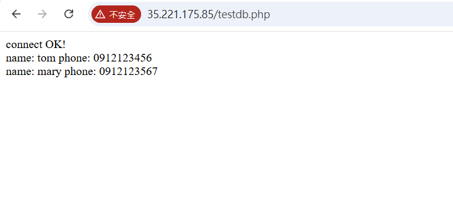
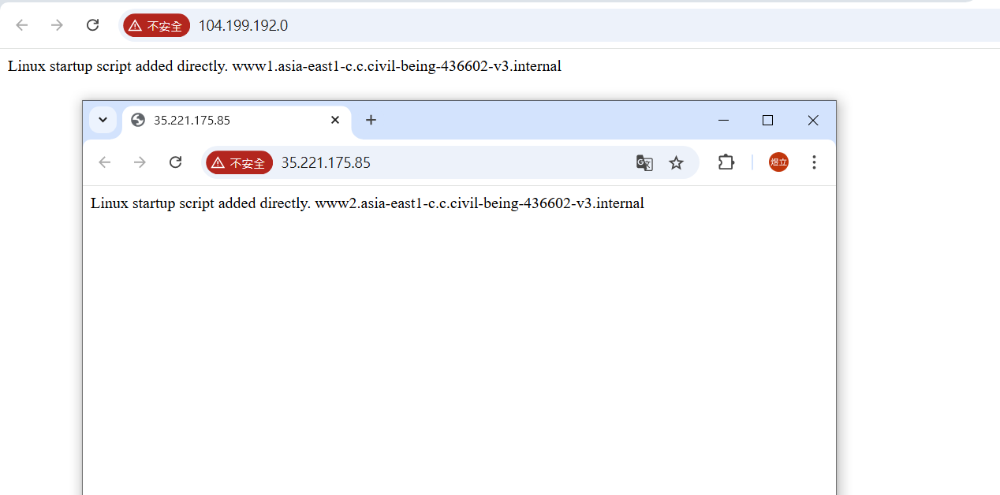
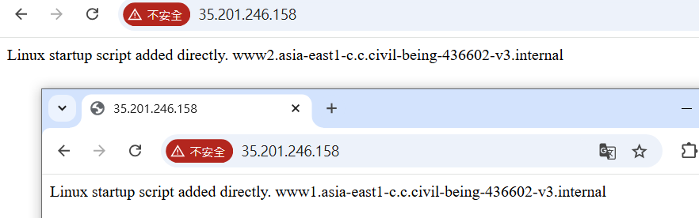

# 第八周 
## Cloud SQL
建立資料庫
````
到SQL的頁面
點擊Create instance with your free credits
點擊CHOOSE MYSQL
選擇Enterprise Plus
Edition preset選擇Development
Database version選擇MYSQL8.0
Instamce ID:mydb
password:12345678
Region:asia-east1(Taiwan)
Zonal availability選擇Single zone
Create Instance
````
測試資料庫是否建立成功
````
打開cloud shell
sudo apt install mysql-client -y
gcloud sql connect mydb --user=root --quiet
mysql -h 35.221.136.188(sql ip) -u root -p
show databases;
````


把公共ip改成私有ip
````
編輯mydb
點開connections
取消勾選Public ip，勾選Private ip
Network選擇default
save
````


使用虛擬機連到sql
````
創建一台mywww虛擬機，網路選擇default，記得勾選允許http連線
sudo apt install mysql-client -y
mysql -h 10.93.144.3(mysql ip) -u root -p
````


創建網頁<br>
https://github.com/stereomp3/note/blob/main/linux/111semester01/13-.md#LAMP
````
sudo apt install apache2 php libapache2-mod-php php-mysql
sudo systemctl restart apache2
sudo vim testdb.php
````
記得更改servername為sql ip
````
<?php
$servername="10.93.144.3";
$username="root";    
$password="12345678";
$dbname="testdb";

$conn = new mysqli($servername, $username, $password, $dbname);

if($conn->connect_error){
    die("connection failed: " . $conn->connect_error);
}
else{
    echo "connect OK!" . "<br>";
}

$sql="select name,phone from addrbook";
$result=$conn->query($sql);

if($result->num_rows>0){
    while($row=$result->fetch_assoc()){
        echo "name: " . $row["name"] . "\tphone: " . $row["phone"] . "<br>";
    }
} else {
    echo "0 record";
}
?>

:wq儲存退出
````

````
sudo mv testdb.php /var/www/html
mysql -h 10.93.144.3 -u root -p
create database testdb; 
use testdb;
create table addrbook(name varchar(50) not null, phone char(10));
insert into addrbook(name, phone) values ("tom", "0912123456");
insert into addrbook(name, phone) values ("mary", "0912123567");
到瀏覽器用External ip連線
````


## 負載均衡器
負載均衡器必須在同一region，且同一zone<br>
建立2台虛擬機
````
建立www1、www2虛擬機
region:asia-east1(Taiwan)
Zone:asia-east1-c
N1
系統ubuntu
勾選http防火牆
Automation貼上:

#! /bin/bash
 apt update
 apt -y install apache2
 cat <<EOF > /var/www/html/index.html
 <html><body><p>Linux startup script added directly. $(hostname -f) </p></body></html>

Create
````


Instance groups
````
左側進入Instance groups頁面
Create Instance group
左側選擇New unmanaged instance group
Name:www-group
Region:Taiwan
Zone:asia-east-c
network:default
Select VMs:Select all
Create
````
建立負載均衡器
````
搜尋network services
Create load balancer
選擇Application Load Balancer (HTTP/HTTPS)
Next
選擇Public facing (external)
Next
選擇Best for regional workloads
Next
Configure
Name:mylb
Region:asia-east1(Taiwan)
Network:default
點擊下方Frontend configuration
右側Best for regional workloads
Name:myfrontend
Done
點擊下方Backend configuration
Name:mybackend
Instance group選擇www-group
Port number:80
Health check:Create a Health check
Name:httphealthcheck
Save
Create
Create
````
````
點進mylb，複製ip到瀏覽器
同一個ip會出現不同網頁
````

