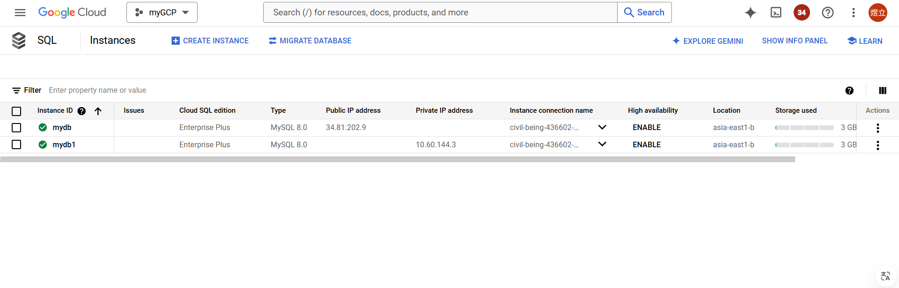
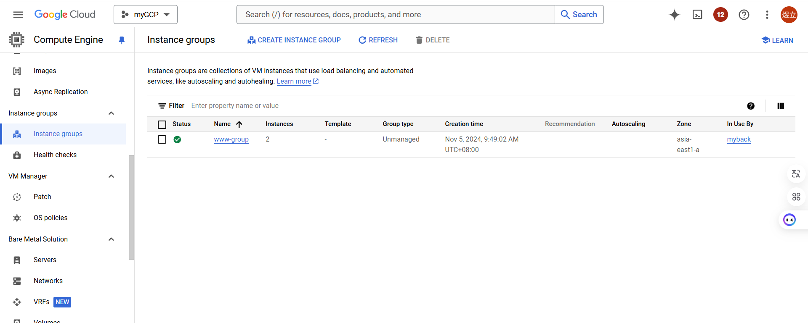
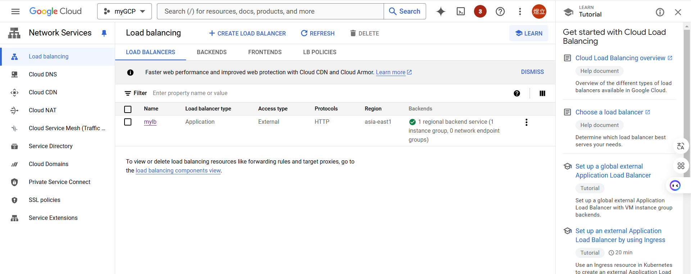
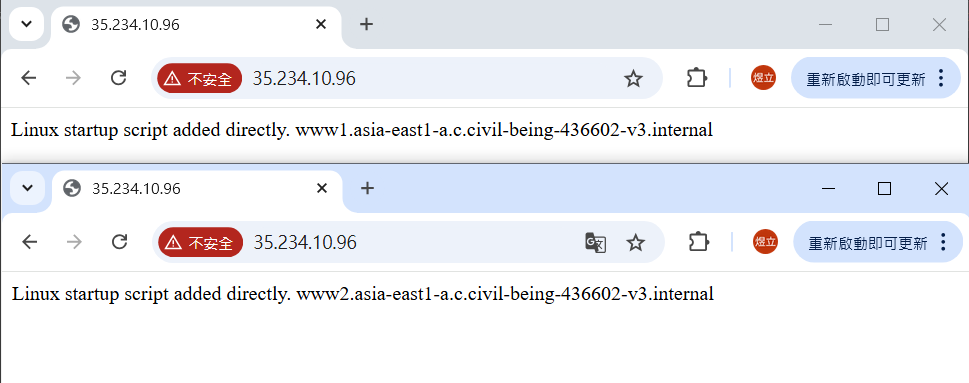
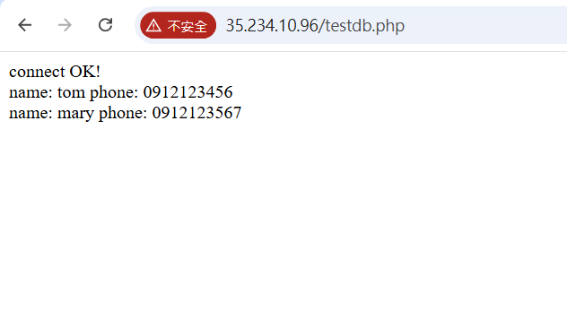

# 第九周 期中
## 題目要求
You need to create two vpc networks, i.e. myvpc1 and myvpc2.  
In myvpc1 (any zone), create two VMs with http server. In myvpc2, create DB (vm or cloud sql). make http servers connect to DB.  
Also add one load balancer. If a customer connect to LB, LB will dispatch the traffic to the backend http server.  
# 步驟
創建vpc1-1跟vpc2-1

創建www1與www2，網路選擇vpc1-1

創建mydb1，網路選擇vpc2-1

把www1與www2放進同一group

用group創建LB，LB網路選擇vpc1-1

 
www1與www2連上db，創建Database 

