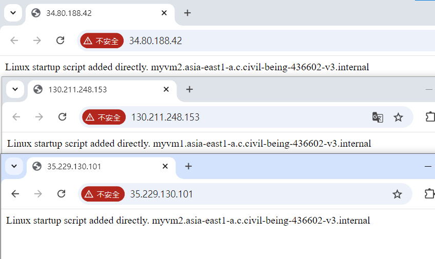
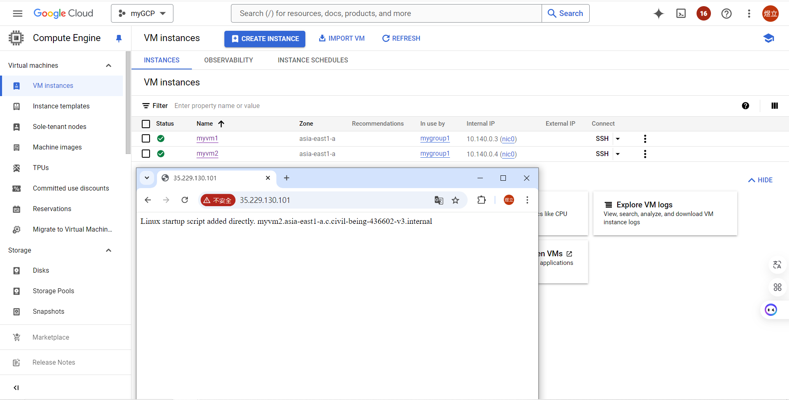
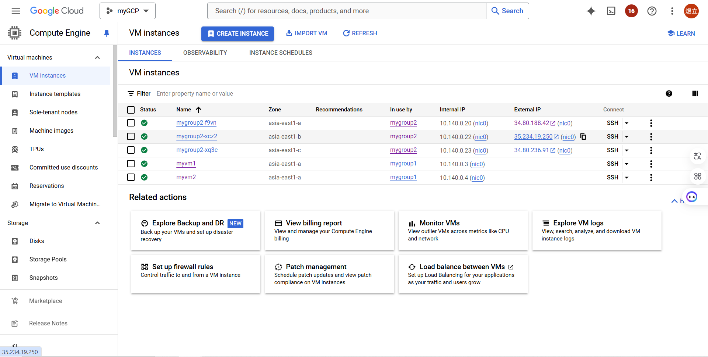

# 第十周
## 取消Public IP
創建負載均衡器
````
創建myvm1、myvm2，2台虛擬機，zone選擇asia-east1-a，network選擇myvpc1，automation貼上

#! /bin/bash
 apt update
 apt -y install apache2
 cat <<EOF > /var/www/html/index.html
 <html><body><p>Linux startup script added directly. $(hostname -f) </p></body></html>
````
````
創建一個Instance group，mygroup，選擇New unmanaged instance group，
Zone:asia-east-a，網路選擇myvpc1，把myvm1、myvm2加進去
創建一個load balancer
選擇Application Load Balancer (HTTP/HTTPS)
選擇Public facing (external)
選擇Best for regional workloads
Name:mylb
Region:asia-east1(Taiwan)
Network:myvpc1
點擊下方Frontend configuration
Name:myfrontend
Done
點擊下方Backend configuration
Name:mybackend
Instance group選擇mygroup
Port number:80
Health check:Create a Health check
Name:httphealthcheck
Create
````


新增防火牆規則
````
到Firewall頁面
Create a firewall rule
Name:myvpc1-allow-http2
Network:myvpc1
Target tags:http2
Source IPv4 ranges :10.0.0.0/8
勾選Tcp
Port:80
Create
````
再創建一個
````
Name:myvpc1-allow-healthcheck
Network:myvpc1
Target tags:hc
Source IPv4 ranges :35.191.0.0/16與130.211.0.0/22
勾選Tcp
Port:80
````
更改虛擬機的網路設定
````
編輯myvm1、myvm2
Network interfaces
External IPv4 address:選擇None
取消勾選Allow HTTP traffic
Network tags:http2、hc
````


## 讓伺服器數量隨客流數增減
創建templates
````
到Compute Engine中的Instance templates
Create instance template
Name:my-template
Region:asia-east1(Taiwan)
選擇N1
Boot disk選擇Ubuntu
勾選Allow HTTP traffic
Automation貼上

#! /bin/bash
 apt update
 apt -y install apache2
 cat <<EOF > /var/www/html/index.html
 <html><body><p>Linux startup script added directly. $(hostname -I) </p></body></html>

Create
````
創建Instance group
````
進入Instance groups頁面
Create Instance Group
左側選擇New managed instance group (stateless)
Name:mygroup2
Instance template選擇my-template1
選擇Multiple zones
Maximum number of instances:3
Autohealing
Health check
Create a Health check
Name:instance-group-hc
Check interval:10
Timeout:10
Healthy threshold:3
Unhealthy threshold:3
Save
Create
````
自動生成機器<br>
https://superuser.com/questions/443406/how-can-i-produce-high-cpu-load-on-a-linux-server
````
使用ssh連線系統創造好的虛擬機
cat /dev/zero > /dev/null
(可開另一台ssh，使用top指令查看當前負荷)
等待一下刷新頁面，可以看到系統自動生成的虛擬機
````

