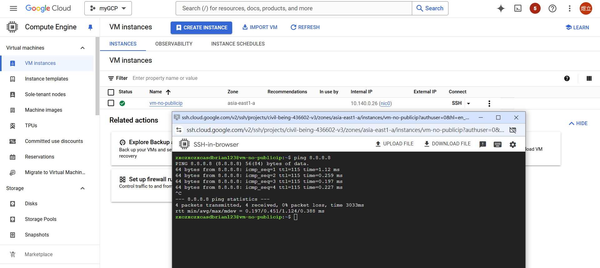
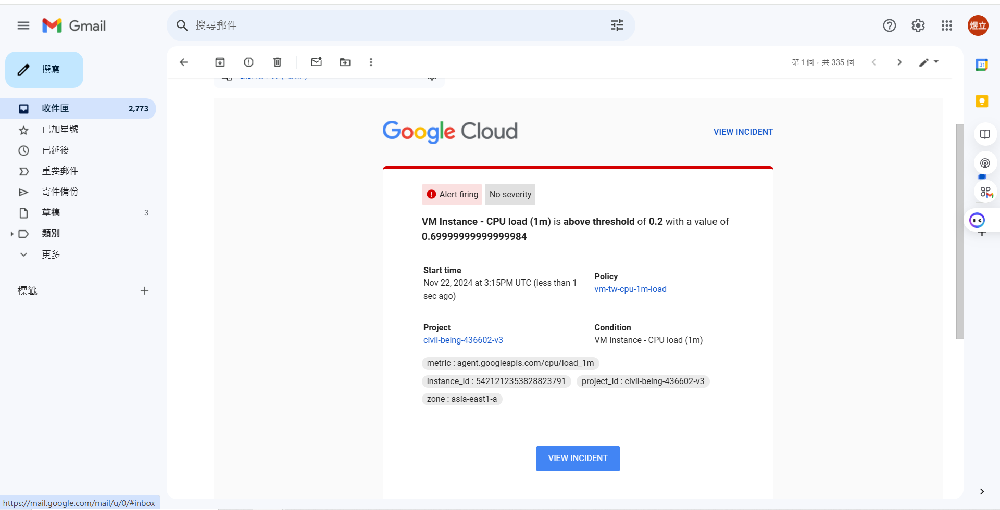
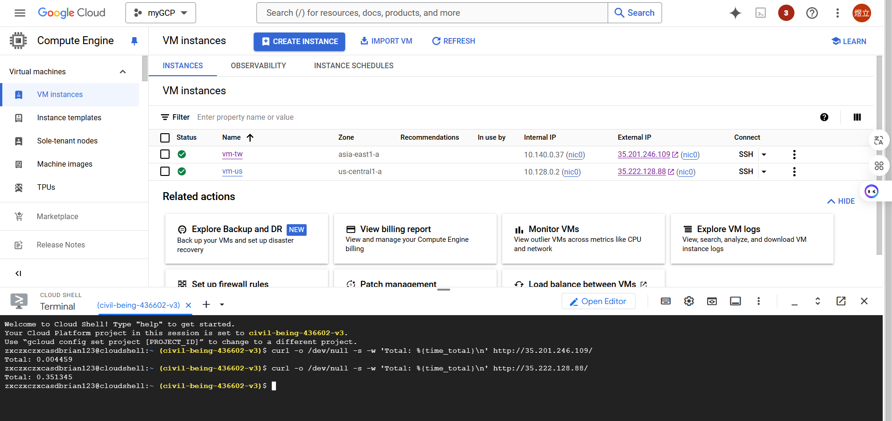
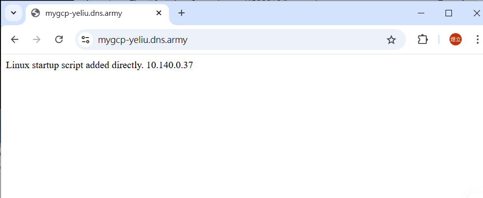

# 第十一周
## cloud router
不需要搭配internal ip即可跟外部連線，提高安全性
````
創建一台虛擬機，HTTP不需要打勾，Network interfaces裡的External IPv4 address選擇None
進入Network Services頁面，選擇左側Cloud NAT
Get Started
Name:default-nat
Network:default
Region:asia-east1(Taiwan)
Cloud Router
Create a route
Name:default-router
Create
Create
虛擬機SSH即可連線
````


## Monitoring
查看監測
````
創建虛擬機vm-tw，貼上
#! /bin/bash
 apt update
 apt -y install apache2
 cat <<EOF > /var/www/html/index.html
 <html><body><p>Linux startup script added directly. $(hostname -I) </p></body></html>

測試網頁可否出現Apache2
點進虛擬機vm-tw，第2個選項Observability，選擇Last 15 minutes
點擊左邊Install ops agent
````
把監測結果發至郵箱
````
進入Monitoring，左側Alerting
Edit notification channels
修改Email
````
使用 Ops Agent 收集 Apache Web 服務器指標
https://cloud.google.com/monitoring/monitor-compute-engine-virtual-machine?hl=zh-cn#install_apache_server
````
SSH連線vm-tw，直接貼上下面指令後按Enter

# Configures Ops Agent to collect telemetry from the app and restart Ops Agent.

set -e

# Create a back up of the existing file so existing configurations are not lost.
sudo cp /etc/google-cloud-ops-agent/config.yaml /etc/google-cloud-ops-agent/config.yaml.bak

# Configure the Ops Agent.
sudo tee /etc/google-cloud-ops-agent/config.yaml > /dev/null << EOF
metrics:
  receivers:
    apache:
      type: apache
  service:
    pipelines:
      apache:
        receivers:
          - apache
logging:
  receivers:
    apache_access:
      type: apache_access
    apache_error:
      type: apache_error
  service:
    pipelines:
      apache:
        receivers:
          - apache_access
          - apache_error
EOF

sudo service google-cloud-ops-agent restart
sleep 60
````
````
另開一台SSH，貼上
timeout 120 bash -c -- 'while true; do curl localhost; sleep $((RANDOM % 4)) ; done'
點進vm-tw，Observability
點擊下面Monitor vm Instances
點擊左上VM Instances旁的上一頁箭頭
點擊右側Apache Overview即可監測
````
設定臨界值通知(未成功，改用cpu)
````
點擊左側Alerting
Create policy
Select a metric選擇VM Instance
選擇Apache
選擇Workload/apache traffic
Apply
Transform data
Rolling window:1 min
Next
選擇Threshold
Threshold value:100
Next
Notification channels:選擇Email
Notification subject line:vm-tw-apache-traffic-alert
Name the alert policy:vm-tw-apache-traffic-alert
Next
Create policy

虛擬機輸入timeout 120 bash -c -- 'while true; do curl localhost; sleep $((RANDOM % 4)) ; done'
等待信件通知
````
若無法成功下載ops agent
````
到下面網頁(要更改prohrct名)啟動
https://console.cloud.google.com/apis/enableflow?apiid=compute.googleapis.com,monitoring.googleapis.com,logging.googleapis.com&project=mygcp-436602
````


## 測試虛擬機放在他國速度
創建一台放在美國的虛擬機
````
Name:vm-us
Region:us-central1(lowa)
勾選http
Automation貼上
#! /bin/bash
 apt update
 apt -y install apache2
 cat <<EOF > /var/www/html/index.html
 <html><body><p>Linux startup script added directly. $(hostname -I) </p></body></html>
````
````
開啟cloud shell
curl -o /dev/null -s -w 'Total: %{time_total}\n' http://35.201.246.109/(台灣網址)
curl -o /dev/null -s -w 'Total: %{time_total}\n' http://35.222.128.88/(美國網址)
````


## HTTPS連線
Instance groups
````
看vm-tw在哪個區域
到Instance groups頁面
Create instance group
選擇New unmanaged instance group
Region:Taiwan
Zone:視vm-tw而定
Neetwork:default
VM instances:vm-tw
Create
````
Load balancing
````
到Network Services頁面
Creaete Load balancing
選擇Application Load Balancer (HTTP/HTTPS)
Next
選擇Public facing (external)
Next
選擇Best for global workloads
Next
選擇Global external Application Load Balancer
Next
Configure
Name:mylb
Front configuration
Name:myfrontend
Proticol:選擇HTTPS
Certificate
Create a New Certificate
Name:cert-1
選擇Create Google-managed certificate
Domain 1:mygcp-yeliu.dns.army
Create
Done
Backend configuration
Create a backend service
Name:mybackend
Instance group:選擇Instance-group-1
Port number:80
取消勾選Enable Cloud CDN
Create a Health Check
Name:health-check
Save
Create
Create
````

````
點進mylb
複製網址貼上
到這個網站https://dynv6.com/zones/new
Name:mygcp-yeliu.dns.army
IPv4 Address:剛剛複製的網址
Create Zone
打開cmd
ping mygcp-yeliu.dns.army
打開網頁
貼上mygcp-yeliu.dns.army
等待一下使網址生效
````


## Cloud CDN
````
到虛擬機頁面
確認vm-us在哪一區
進入Instance groups
Create Instance Group
選擇New unmanaged instance group
Region:lowa
Zone:vm-us的區域
Network:default
Select VMs:vm-us
Create
````
````
到Network Services頁面
Creaete Load balancing
選擇Application Load Balancer (HTTP/HTTPS)
Next
選擇Public facing (external)
Next
選擇Best for global workloads
Next
選擇Classic Application Load Balancer
Next
Configure
Name:mylb2
Frontend configuration
Name:myfrontend2
Done
Backend configuration
Create a backend service
Name:mybackend2
Instance group:選擇Instance-group-2(us-central-a)
Port number:80
勾選Enable Cloud CDN
選擇一個Health check
Create
Create
````

````

````
