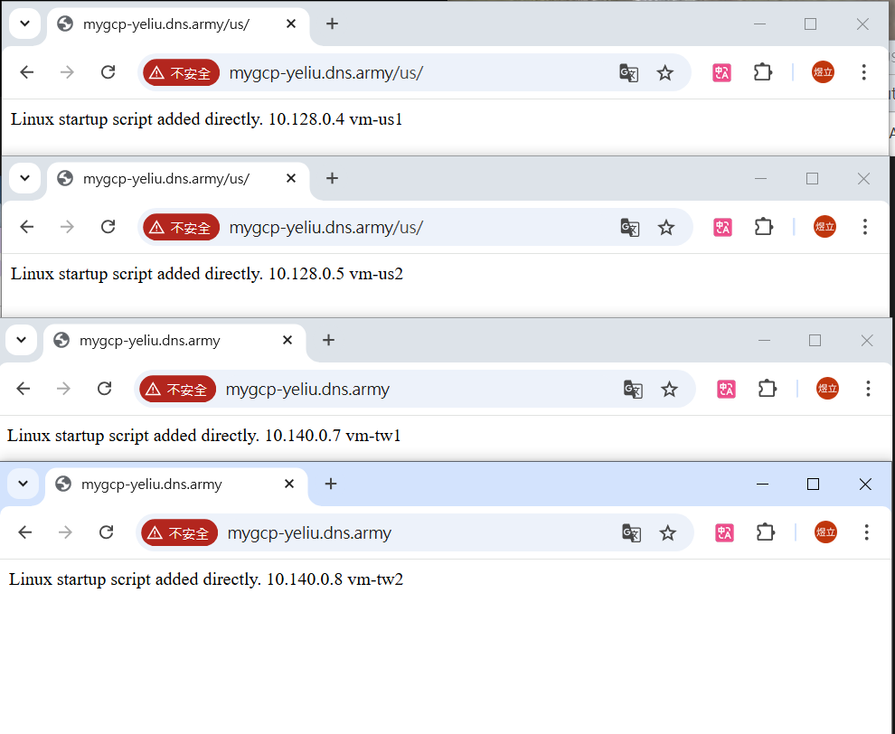

# 第十二周
## DDOS防護
https://mile.cloud/zh/resources/blog/ddos-protection-cloud-armor-ip-load-balancing_565
<br>付費功能
````
進入Network Security
點擊左邊Cloud Amor policies
Create Policy
Name:mypolicy
選擇Backend security policy
Match輸入
origin.region_code == 'US'_|| origin.region_code == 'TW'
Action選擇Allow
Create policy
````
## 進階負載均衡器
創建2個Cloud Nat，用來連接us與tw的網路
````
到Network Services頁面
點擊左側Cloud Nat
Create Cloud NAT gateway
Name:myvpc1-nat2、myvpc1-nat
Network選擇myvpc1
Region選擇(lowa)、(Taiwan)
Cloud Router
Create new router
Name:myvpc1-router2、myvpc1-router
Create
Create
````
建立4個虛擬機
````
建立vm-tw1及vm-tw2，Region:Taiwan，Zone:a，
勾選Allow Http，Network:myvpc1
External IPv4 address選擇None
Automationw貼上
#! /bin/bash
apt update
apt -y install apache2
cat <<EOF > /var/www/html/index.html
<html><body><p>Linux startup script added directly. $(hostname -I) vm-tw1 </p></body></html>
(最後vm-tw1記得改)

````
````
建立vm-us1及vm-us2，Region:lowa，Zone:a，
勾選Allow Http，Network:myvpc1
External IPv4 address選擇None
Automationw貼上
#! /bin/bash
apt update
apt -y install apache2
cat <<EOF > /var/www/html/index.html
<html><body><p>Linux startup script added directly. $(hostname -I) vm-us1 </p></body></html>
````
創建2個Instance Group
````
進入Instance Group頁面
Create Instance Group
選擇New unmanaged instance group
Name:instance-group-tw
Region:tw
Zone:a
Network:myvpc1
Subnetwork:myvpc1
Select VMs:選擇2台虛擬機
Create
````
````
進入Instance Group頁面
Create Instance Group
選擇New unmanaged instance group
Name:instance-group-us
Region:lowa
Zone:a
Network:myvpc1
Subnetwork:myvpc1
Select VMs:選擇2台虛擬機
Create
````
負載均衡器
https://dynv6.com/zones/4500019/edit
````
進入Network Services頁面
Create load balance
選擇Http/Https
選擇external
選擇global
選擇Classic Application Load Balancer
Configure
Name:mygloballb
Frontend configuration
Name:myfe
Backend configuration
Name:mybe1
Instance Group:選擇tw
Port number:80
Health check
Create
再一個Backend
Name:mybe2
Instance Group:選擇us
Port number:80
Health check
Create
勾選2個backend
Routing rules
Host2:mygcp-yeliu.dns.army
Path2:/us/*
backend1:mybe1
backend2:mybe2
Create
````
設置IP
````
點進my-global-lb複製ip
到IPV6中貼上
````
````
SSH連線us1虛擬機
cd /var/www/html
ls
sudo mkdir us
sudo cp index.html us

SSH連線us2虛擬機
cd /var/www/html
sudo mkdir us
sudo cp index.html us
````

