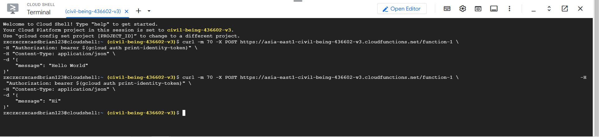
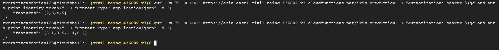
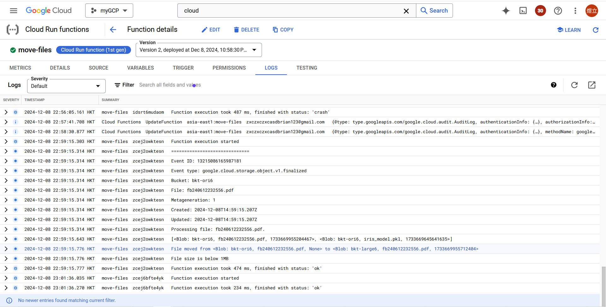
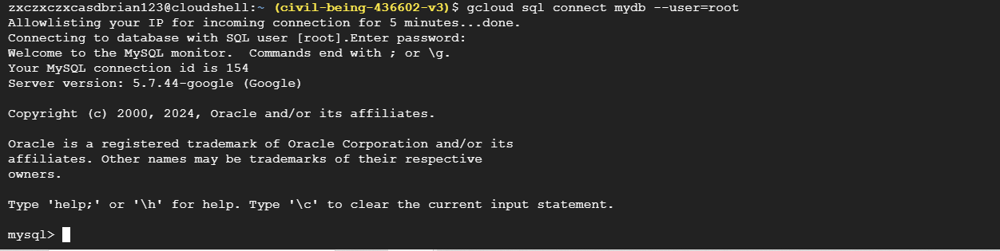

# 第十三周
## cloud funtion
一種事件驅動的服務
````
進入到cloud Run funtion頁面
Create funtion
Environment:Cloud Run function (1st gen)
Region:Taiwan
trigger type:HTTP
Authentication選擇Allow unauthenticated invocations
勾選Require HTTPS
Maximum number of instances:32
Next
Runtime選擇Python3.12
Deploy
````
測試
````
點擊testing
複製CLI test command
點擊Cloud shell
貼上剛剛複製的程式碼
````


## Iris
https://towardsdatascience.com/machine-learning-model-as-a-serverless-endpoint-using-google-cloud-function-a5ad1080a59e<br>
https://github.com/saedhussain/gcp_serverless_ml
````
打開Cloud shell
mkdir test_iris
cd test_iris/
git clone https://github.com/saedhussain/gcp_serverless_ml.git
ls
cd gcp_serverless_ml/
ls
cd Iris_model/
ls
cd data
ls
cat Iris_data.csv
點擊Open Editor
點擊檔案的圖標
點擊Open folder
按OK
找到create_iris_model.py
把最後一行改成"iris_model.pkl"
````
下載模型
````
cd test_iris/
cd gcp_serverless_ml/
cd Iris_model/
pip install numpy
pip install pandas
pip install scikit-learn
python create_iris_model.py
pwd
複製位置
點擊右上角3個點
Download
貼上複製的路徑，後面加上/iris_model.pkl
把下載好的模型放在桌面上
````
上傳資料
````
到Cloud Storage頁面
buckets
Create
name:mybkt-iris
Continue
選擇Region，選擇Taiwan
Continue
Continue
Continue
Continue
Create
點擊upload，上傳剛剛下載的資料
````
````
到Cloud funtions頁面
Create funtion
Environment選擇Cloud Run function (1st gen)
Name:iris_prediction
Region:Taiwan
選擇Allow unauthenticated invocations
Save
Next
Runtime選擇Python3.8
複製github上Iris_http_cloud_func檔案，分別貼到txt及py檔
改 BUCKET_NAME、PROJECT_ID、GCS_MODEL_FILE
把Entry point改成iris_predict
Deploy
點擊Testing
複製CLI test command內容
打開cloud shell貼上
把最後一行Hello world改成
"features": [2,3,4,5]
按enter
````


# 上傳大於1MB檔案時會自動轉到另一個Bucket
創建2個Bucket
````
到Cloud storage頁面
點擊左側Buckets
Create
Name:bkt-ori6
Continue
選擇Region:Taiwan
Continue
Continue
Continue
Create
再創建一個Bucket
Create
Name:bkt-large6
Continue
選擇Region:Taiwan
Continue
Continue
Continue
Create
````
創建Cloud funtion
````
到Cloud funtion頁面
Create funtion
Envitonment選擇Cloud Run function (1st gen)
Name:move-files
Region:Taiwan
Trigger type選擇Cloud Storage
Event type選擇On (finalizing/creating) file in the selected bucket
Bucket選擇bkt-ori
Save
Next
Runtime選擇Python 3.12
Entry point:hello-gcs
requirements.txt貼上

functions-framework==3.*
google-cloud-storage
google-cloud

main.py貼上

import functions_framework
from google.cloud import storage
from google.cloud.storage import Blob


# Triggered by a change in a storage bucket
@functions_framework.cloud_event
def hello_gcs(cloud_event):

    data = cloud_event.data

    event_id = cloud_event["id"]
    event_type = cloud_event["type"]

    bucket = data["bucket"]
    name = data["name"]
    metageneration = data["metageneration"]
    timeCreated = data["timeCreated"]
    updated = data["updated"]
    
    print("="*30)
    print(f"Event ID: {event_id}")
    print(f"Event type: {event_type}")
    print(f"Bucket: {bucket}")
    print(f"File: {name}")
    print(f"Metageneration: {metageneration}")
    print(f"Created: {timeCreated}")
    print(f"Updated: {updated}")
    print(f"Processing file: {name}.")
    storage_client = storage.Client(project='mygcp-436602')
    source_bucket=storage_client.get_bucket('mybkt-src')
    destination_bucket=storage_client.get_bucket('mybkt-dst') 
    blobs=list(source_bucket.list_blobs(prefix=''))
    print(blobs)
    for blob in blobs:
        if blob.size > 1000000 and blob.name == name:
            source_blob = source_bucket.blob(blob.name)
            new_blob = source_bucket.copy_blob(source_blob, destination_bucket, blob.name) 
            blob.delete(if_generation_match=None)
            print(f'File moved from {source_blob} to {new_blob}')
        else:
            print("File size is below 1MB")
````
````
改程式碼
第30行project名稱改成civil-being-436602-v3
第31行bucket名稱改成bkt-ori6
第32行bucket名稱改成bkt-large6
Deploy
````
````
到Cloud storage頁面
進入Bkt-ori6
上傳iris_model.pkl
上傳任意一個大於1MB的檔案
````


# 遠端創建sql
````
打開cloud shell，貼上
gcloud sql instances create mydb 
--database-version=MYSQL_5_7 
--cpu=2 
--memory=4GB 
--root-password=admin1234 
--assign-ip 
--zone=us-central1-a 
--availability-type=zonal 
--no-backup


到sql頁面，確認是否成功創建
創建資料庫，cloud shell貼上
gcloud sql databases create demo-db --instance=mydb, -i mydb
查看是否能成功連線
gcloud sql connect mydb --user=root
密碼:admin1234
````

