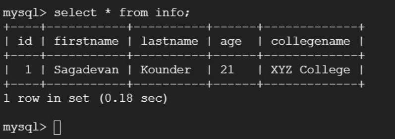
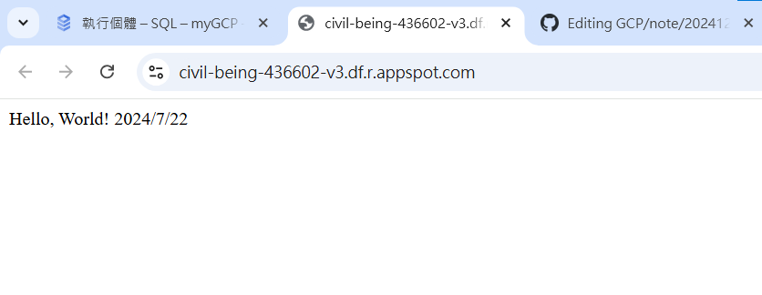

# 第十三周
## 使用遠端方式用SQL
````
打開cloud shell
gcloud sql databases create testdb --instance=mydb, -i mydb
gcloud sql connect mydb --user=root
密碼admin1234
use testdb;
CREATE TABLE info (
id INT NOT NULL AUTO_INCREMENT,
firstname VARCHAR(20),
lastname VARCHAR(20),
age VARCHAR(3),
collegename VARCHAR(150),
PRIMARY KEY (id)
);
另開一個cloud shell，
mkdir cf_mysql
cd cf_mysql
sudo vim main.py
貼上

import sqlalchemy
#connection name we noted earlier
connection_name = "mygcp-436602:us-central1:mydb"
#database name
db_name = "testdb"
db_user = "root"
db_password = "admin1234"
driver_name = 'mysql+pymysql'
query_string = dict({"unix_socket": "/cloudsql/{}".format(connection_name)})

def writeToSql(request):
   #You can change this to match your personal details
   stmt = sqlalchemy.text("INSERT INTO info ( firstname, lastname, age, collegename) values ('Sagadevan', 'Kounder', '21', 'XYZ College')")

   db = sqlalchemy.create_engine(
   sqlalchemy.engine.url.URL(
   drivername=driver_name,
   username=db_user,
   password=db_password,
   database=db_name,
   query=query_string,
   ),
   pool_size=5,
   max_overflow=2,
   pool_timeout=30,
   pool_recycle=1800
   )
   try:
      with db.connect() as conn:
        conn.execute(stmt)
        print("Insert successful")
   except Exception as e:
      print ("Some exception occured" + e)
      return 'Error: {}'.format(str(e))
   return 'ok'

esc
:wq
記得更改專案名稱
````

````
sudo vim requirements.txt
貼上
SQLAlchemy==1.3.12
PYMYSQL==0.9.3

:wq儲存

gcloud functions deploy writeToSql --entry-point writeToSql --runtime python310 --trigger-http --allow-unauthenticated  --no-gen2 --source .
到funtion run頁面即可看到部屬好的程式
點進函數中，testing
複製CLI test command
在cloud shell貼上
sql中輸入
select * from info;
````


## APP Engine
````
打開cloud shell
mkdir -p test-flask
cd test-flask
touch app.yaml main.py requirements.txt
sudo vim main.py

from flask import Flask
app = Flask(name)

@app.route("/")
def hello():
    return "Hello, World! 2024/7/22"

if name == "main":
    app.run(debug=True)


sudo vim requirements.txt

flask


sudo vim app.yaml


runtime: python39
service: default

gcloud app deploy
gcloud app browse
點擊網址
````


## 
````
mkdir test-iris
cd test-iris
touch app.yaml client.py main.py requirements.txt train_model.py
sudo vim train_model.py

# -*- coding: utf-8 -*-
import pickle
from sklearn import datasets
from sklearn.model_selection import train_test_split
from sklearn import tree

# simple demo for traing and saving model
iris=datasets.load_iris()
x=iris.data
y=iris.target

#labels for iris dataset
labels ={
  0: "setosa",
  1: "versicolor",
  2: "virginica"
}

x_train, x_test, y_train, y_test = train_test_split(x, y, test_size=.25)
classifier=tree.DecisionTreeClassifier()
classifier.fit(x_train,y_train)
predictions=classifier.predict(x_test)

#export the model
model_name = 'model.pkl'
print("finished training and dump the model as {0}".format(model_name))
pickle.dump(classifier, open(model_name,'wb'))
````

sudo vim requirements.txt
````
scikit-learn 
flask
````
sudo vim main.py
````
import pickle

from flask import Flask, request, jsonify

app = Flask(__name)

# Load the model
model = pickle.load(open('model.pkl', 'rb'))
labels = {
  0: "versicolor",
  1: "setosa",
  2: "virginica"
}

@app.route("/", methods=["GET"])
def index():
    """Basic HTML response."""
    body = (
        "<html>"
        "<body style='padding: 10px;'>"
        "<h1>Welcome to my Flask API</h1>"
        "</body>"
        "</html>"
    )
    return body

@app.route('/api', methods=['POST'])
def predict():
    # Get the data from the POST request.
    data = request.get_json(force = True)
    predict = model.predict(data['feature'])
    return jsonify(predict[0].tolist())

if name == 'main__':
    app.run(debug = True, host = '0.0.0.0', port=8080)

````
sudo vim client.py
````
# -*- coding: utf-8 -*-
import requests
# Change the value of experience that you want to test
url = 'https://iris-predict-dot-mygcp-436602.de.r.appspot.com/api'   # 改成 127.0.0.1
feature = [[5.8, 4.0, 1.2, 0.2]]
labels ={
  0: "setosa",
  1: "versicolor",
  2: "virginica"
}

r = requests.post(url,json={'feature': feature})
print(labels[r.json()])
````
sudo vim app.yaml
````
runtime: python312
service: iris-predict
````
````
pip install -r requirements.txt
conda activate python3.9
````
