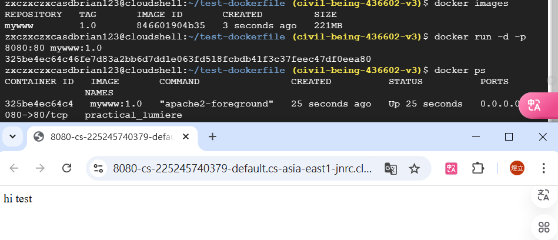
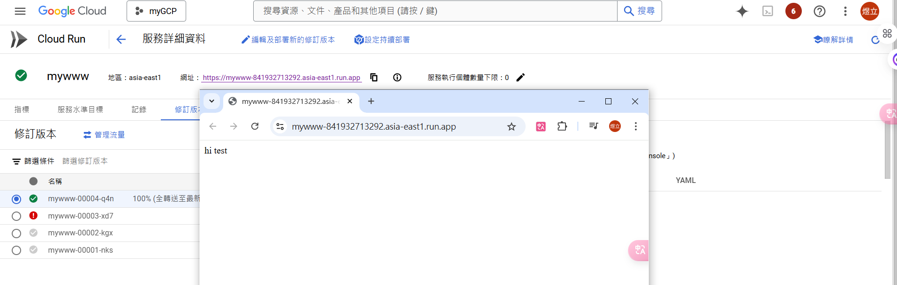

# 第十五周
## Docker
````
打開cloud shell
cd test-dockerfile
sudo vim index.html
hi test

:wq
docker build -t mywww:1.0 .
docker images
docker run -d -p 8080:80 mywww:1.0
docker ps
打開網頁
````


````
建立一個名字為mydocker的存放區
docker build -t  asia-east1-docker.pkg.dev/civil-being-436602-v3/mydocker/mywww:1.0 .
docker push  asia-east1-docker.pkg.dev/civil-being-436602-v3/mydocker/mywww:1.0

gcloud run deploy mywww \
    --image asia-east1-docker.pkg.dev/civil-being-436602-v3/mydocker/mywww:1.0 \
    --platform managed \
    --region asia-east1 \
    --allow-unauthenticated

到cloud run頁面
點進mywww中
把port改成80
````


# IRIS
````
mkdir test-iris-docker
cd test-iris-docker
touch client2.py client.py Dockerfile main.py requirements.txt
touch train_model.py
sudo vim train_model.py


# -*- coding: utf-8 -*-
import pickle
from sklearn import datasets
from sklearn.model_selection import train_test_split
from sklearn import tree

# simple demo for traing and saving model
iris=datasets.load_iris()
x=iris.data
y=iris.target

#labels for iris dataset
labels ={
  0: "setosa",
  1: "versicolor",
  2: "virginica"
}

x_train, x_test, y_train, y_test = train_test_split(x, y, test_size=.25)
classifier=tree.DecisionTreeClassifier()
classifier.fit(x_train,y_train)
predictions=classifier.predict(x_test)

#export the model
model_name = 'model.pkl'
print("finished training and dump the model as {0}".format(model_name))
pickle.dump(classifier, open(model_name,'wb'))

````
sudo vim requirements.txt
````
scikit-learn 
flask
````
sudo vim main.py
````
import pickle

from flask import Flask, request, jsonify

app = Flask(__name__)

# Load the model
model = pickle.load(open('model.pkl', 'rb'))
labels = {
  0: "versicolor",
  1: "setosa",
  2: "virginica"
}

@app.route("/", methods=["GET"])
def index():
    """Basic HTML response."""
    body = (
        "<html>"
        "<body style='padding: 10px;'>"
        "<h1>Welcome to my Flask API</h1>"
        "</body>"
        "</html>"
    )
    return body

@app.route('/api', methods=['POST'])
def predict():
    # Get the data from the POST request.
    data = request.get_json(force = True)
    predict = model.predict(data['feature'])
    return jsonify(predict[0].tolist())

if __name__ == '__main__':
    app.run(debug = True, host = '0.0.0.0', port=8080)
````
sudo vim Dockerfile
````
FROM python:3.9
 
WORKDIR /app
 
ADD . /app
 
RUN pip install -r requirements.txt
 
CMD ["python", "main.py"]

EXPOSE 8080
````
sudo vim client2.py
````
# -*- coding: utf-8 -*-
import requests
# Change the value of experience that you want to test
url = 'http://127.0.0.1:8080/api'
feature = [[5.8, 4.0, 1.2, 0.2]]
labels ={
  0: "setosa",
  1: "versicolor",
  2: "virginica"
}

r = requests.post(url,json={'feature': feature})
print(labels[r.json()])
````
````
python train_model.py
python main.py
docker ps
docker rm -f 27e(conteaner ID前三碼)
python client.py

````
